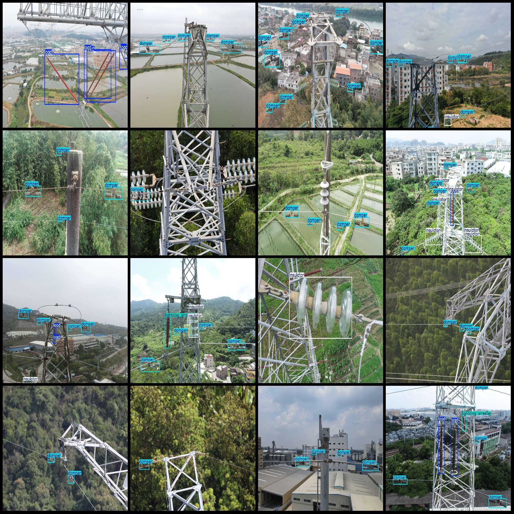
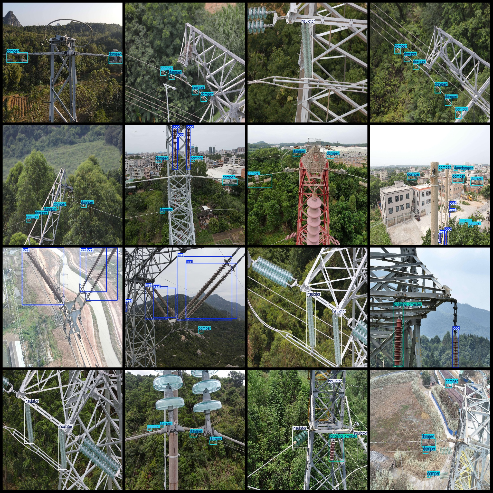

# Power Scene UAV Viewpoint Circuit Insulation Test, Wind Shield Hammer, Lightning Resonator Load Detection Data Set in VOC+YOLO Format with 1883 Categories

The dataset format: Pascal VOC format + YOLO format (do not contain the split path of txt file, only contain jpg images and corresponding VOC format xml file and yolo format txt file)

The number of images (jpg file count): 1883
The number of annotations (xml file count): 1883
The number of annotations (txt file count): 1883
The number of annotation categories: 4
The names of the annotation categories are: ["damper", "insulator", "lightning arrester", "load"].

The number of boxes labeled in each category:

- damper frame count = 6422
- insulator frame count = 1195
- lightning arrestor frame count = 87
- load frame count = 1044

total boxes: 8748

Image resolution: Multiple resolution images, such as 1920x1280, 1920x1440, etc.

Use the labeling tool: labelImg

The annotation rules are: draw a rectangle box for the category.

Important Notes: None

Special Declaration: This dataset does not guarantee the accuracy of the trained models or weight files.

Preview:
## Image

Here is a pay link on Stripe ( https://buy.stripe.com/3cs8yP7sY87d0vu9AB ). Please contact me lonlonago@foxmail.com after funding $89, and I will send you a complete data files , thank you!

